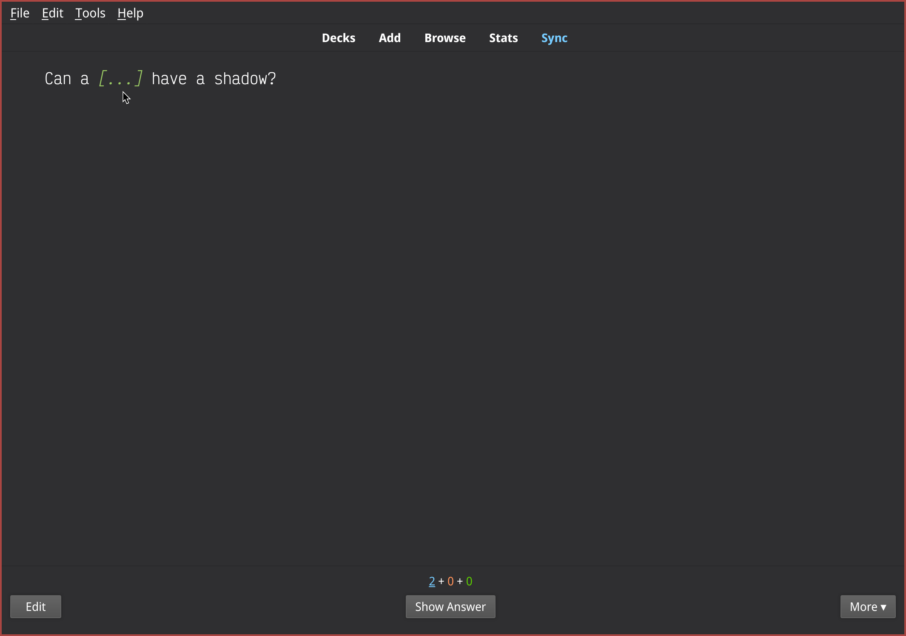

Convert RST to Anki
===================

This is simple RST2Anki converter.
I use predefined models such as:

* Cloze model
* Basic model

Source to generate notes in `conpendium.rst`

Quickstart
-----------

* Install dependencies:
`pip3 install -r requirements.txt`

* Run `main.py`:
`python main.py`

Demo
----
Question

Answer

.. image:: img/screen_example_2.png
    :width: 800

