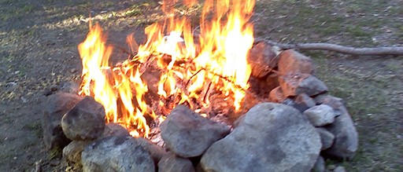

nature, physics
=================
.. this is a cloze note

Can a {{c1::fire}} have a shadow?

.. answer

Yes, you can form the shadow of a fire, but perhaps not for the reason that you are thinking. A shadow is formed any time part of a light beam is blocked or redirected. The shadow region is the region in the light beam where there is less light than in the rest of the beam.

This dimmer region tends to take on the shape of the object that is blocking or redirecting some of the light, so we tend to think of a shadow as something that is cast or created by the intercepting object. With this concept in mind, in order for a fire to have a shadow, the fire needs to somehow block or redirect part of another beam of light.

https://www.wtamu.edu/~cbaird/sq/2015/12/01/can-a-fire-have-a-shadow/

nature, physics 2
==================
.. this is a basic note

Can a fire have a shadow?

.. answer

Yes, you can form the shadow of a fire, but perhaps not for the reason that you are thinking. A shadow is formed any time part of a light beam is blocked or redirected. The shadow region is the region in the light beam where there is less light than in the rest of the beam.

This dimmer region tends to take on the shape of the object that is blocking or redirecting some of the light, so we tend to think of a shadow as something that is cast or created by the intercepting object. With this concept in mind, in order for a fire to have a shadow, the fire needs to somehow block or redirect part of another beam of light.

https://www.wtamu.edu/~cbaird/sq/2015/12/01/can-a-fire-have-a-shadow/
